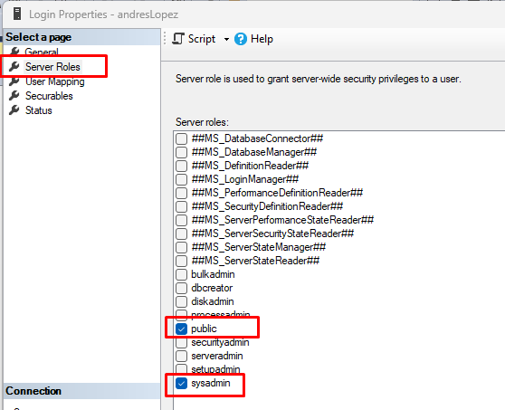
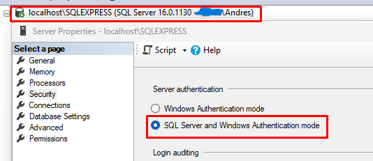

# Servicio Comunitario-API para el Servicio de Asesoramiento Psicológico de la UCV

Desarrollo de una API REST para una página web para consultas y asesoramiento psicológico.

## Herramintas utilizadas

- .NET Core 7.0 
- SQL Server Express y Microsoft SQL Server Management Studio 20

## Ejecución local

### Base de datos

Primeramente, al iniciar Microsoft SQL Server Management Studio, se debe conectar con un servidor usando la opción de "SQL Server Authentication", marcando el usuario y su contraseña.

Para hacer esto, primero se debe crear el login del usuario. Primero se inicia con "Windows Authetication" usando la instancia "localhost\SQLEXPRESS", como se muestra en la siguiente imagen:


Luego, se crea el usuario con la contraseña y los siguientes parámetros:





Posteriormente, con click derecho al nombre del servidor, se selecciona la opción de "Properties" y se cambia el modo de autenticaión a "SQL Server and Windows Authetication mode", como se muestra a continuación:



Finalmente, se reinicia el servidor con la opción "restart" y se conecta con el usuario creado.


Por último, al generar la conexión, se crea la base de datos y se le coloca el nombre de preferencia.

### Dependencias

Antes de ejecutar las migraciones y demás funcionalidades, es necesario descargar todas las dependencias que aparecen en la siguiente imagen:


Estos paquetes se obtienen en la sección de "Herramientas", justamente en la opción "Administrar paquetes NuGet", se selecciona la opción "Administrar paquetes NuGet para la solución..." y a paritr de ahí se descarga cada una de las dependencias con sus versiones exactas.

Nota: Es importante que las versiones sean iguales en cada una de las dependencias mostradas en la imagen anterior, en caso contrario, el proyeco puede fallar.

### Archivo de configuración

El archivo appsentings.json debe tener el siguiente formato para realizar la conexión con la base de datos y generar la clave secreta para los tokens:

```bash

{
    "ApiSettings": {
        "Secreta": "LoQueQuierasColocarSiempreYCuandoTengaNumerosYLetras12345-="
    },
    "ConnectionStrings": {
        "ConexionSql": "Server=localhost\\SQLEXPRESS;Database=nombre_bd;User ID=nombre_usuario;Password=clave_bd;Trusted_Connection=true;TrustServerCertificate=true;MultipleActiveResultSets=true"
    },
    "Logging": {
        "LogLevel": {
            "Default": "Information",
            "Microsoft.AspNetCore": "Warning"
        }
    },
    "AllowedHosts": "*"
}

```

### Migraciones

1. Primeramente, en la sección de "Herramientas", justamente en la opción "Administrar paquetes NuGet", se selecciona la opción "Consola del Admninistrador de Paquetes", y en la consola desplegada se debe escribir el comando:

```bash
update-database

```

2. Si todos los pasos anteriores se realizan de forma correcta, la consola mostrará un mensaje de éxito y la base de datos ya debería tener todas las tablas creadas.


### Ejecución

Al terminar con los pasos anteriores, se ejecuta desde el framework la API, el cual debería aparecer de la siguiente manera:


Se debe tener en cuenta las siguientes condiciones para ejecutar los endpoints:

1. Para iniciar, se deben crear algunos estados y ciudades de Venezuela para crer usuarios.

2. Hay algunos endpoints que, para ser ejecutados, se debe registrar un usuario e iniciar sesión (en ese orden). Se debe recordar que existen tres roles de usuario en esta aplicación:

2.1) admin: Control total para registrar, actualizar y borrar en cualquier controlador presente en la API. Él es quien se encarga de confirmar si un psicólogo es quién dice ser (verificado) y de registrar los trastornos psicológicos existentes.
2.2) psicologo: Puede registrarse, iniciar sesión y actualizar su perfil, colocando su información de contacto y profesional para recibir consultas de cualquier persona. También pueden calificar a otros psicólogos y vincular algún trastorno, indicando su especialidad para tratar dicho problema.
2.3) usuario: Puede registrarse, iniciar sesión y actualizar su perfil, al igual que calificar a algún psicólogo si así lo desea.

Al registrar un usuario y e inicar sesión, se debe mostrar un output con el token asociado a ese usuario (el cual tiene una vigencia de 24 horas):


3. Al iniciar sesión y obtener el token, se debe habilitar la autorización para tener acceso a ciertos endpoints (dependiendo de tu rol como usuario), y se debe marcar de la siguiente forma:


Nota: Para que la autoriazaión no falle, se debe colocar la palabra "Bearer" seguido del token, como se muestra en la imagen anterior.

4. Ya después de eso, es posible ejecutar gran parte de los endpoints. El siguiente ejemplo muestra el output de la creación de un trastorno, el cual solo lo puede ejecutar un admin:


Si se ejecutara este endpoint con otro usuario de un rol distinto a "admin", la API generaría un error 403 por no tener autorización.

## Autores

- ### [@Andrés López](https://github.com/andreselc) [](https://www.linkedin.com/in/andres-lopez-644338281/)


